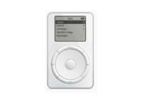

 

Recientemente, Apple ha anunciado mediante una [nota de prensa](https://www.apple.com/newsroom/2022/05/the-music-lives-on/) la retirada del iPod, el predecesor del iPhone que llego hace más de veinte años con el eslogan 1.000 canciones en tu bolsillo y revolucionó la industria de la musica:

> Desde su introducción hace más de 20 años, [el iPod](https://www.apple.com/ipod-touch/) ha cautivado a usuarios de todo el mundo a los que les encanta la capacidad de llevar su música sobre la marcha. Hoy en día, la experiencia de llevar la biblioteca de música al mundo se ha integrado en toda la línea de productos de Apple, desde el iPhone y el Apple Watch hasta el iPad y el Mac, junto con el acceso a más de 90 millones de canciones y más de 30 000 listas de reproducción disponibles a través de Apple Music.
> 
> "La música siempre ha sido parte de nuestro núcleo en Apple, y llevarla a cientos de millones de usuarios en la forma en que lo hizo el iPod impactó más que solo a la industria de la música; también redefinió cómo se descubre, escucha y comparte la música", dijo Greg Joswiak, vicepresidente senior de Marketing Mundial de Apple. “Hoy en día, el espíritu del iPod sigue vivo. Hemos integrado una experiencia musical increíble en todos nuestros productos, desde el iPhone hasta el Apple Watch, el HomePod mini y en el Mac, iPad y Apple TV. Y Apple Music ofrece una calidad de sonido líder en la industria con soporte para audio espacial: no hay mejor manera de disfrutar, descubrir y experimentar música".
> 
> Entre las increíbles formas de disfrutar de la música en una amplia gama de dispositivos, incluida una amplia variedad de modelos, desde el nuevo iPhone SE hasta el último iPhone 13 Pro Max, el iPhone es el mejor dispositivo para transmitir Apple Music o almacenar toda una biblioteca de música sobre la marcha. El Apple Watch y los AirPods son el compañero perfecto, ya que permite a los usuarios acceder a más de 90 millones de canciones directamente desde su muñeca, a partir de solo 279 $ con el Apple Watch SE. El iPad comienza en solo 329 $, viene con un chip más potente, una pantalla más grande y las últimas funciones de iPadOS. Y para disfrutar de la mejor música en casa, el HomePod mini cuesta solo 99 $.
> 
> Los clientes pueden comprar [el iPod touch](https://www.apple.com/ipod-touch/) a través de [apple.com](https://www.apple.com/), las tiendas Apple Store y los distribuidores autorizados Apple hasta agotar existencias.

Por ello hoy hare un pequeño analisis del iPod a lo largo de la historia y hablare del motivo que a provocado que la actual Apple lo deje de producir:

El iPod fue lanzado el 23 de Octubre de 2001 por Steve Jobs que dijo: "El iPod pone mil Canciones en tu Bolsillo", y pese a algunos errores acabo siendo el reproductor de musica mas vendido del mundo, y aunque no fue el primero de su tipo marco la diferencia gracias a algunas de sus caracteristica como su compatibilidad con iTunes en la que se podia comprar canciones desde 0,99 €.

Posteriormente se lanzarian mas gamas de el producto como: El iPod Mini, Nano, Shuffle o el conocido iPod touch. Todos ellos lanzandose en el siguiente orden (Por Meses):

1. Classic 1G
2. Classic 2G
3. Classic 3G
4. Mini 1
5. Photo Color (Classic 4G)
6. Shuffle 1G
7. Mini 2
8. Nano 1G
9. Classic 5G
10. Shuffle 2G y Nano 2G
11. Nano 3G, Classic 6G y Touch 1G
12. Nano 4G y Touch 2G
13. Shuffle 3G
14. Nano 5G y Touch 3G
15. Shuffle 4G
16. Nano 6G y Touch 4G
17. Nano 7G y Touch 5G
18. Shuffle 5G y Touch 6G
19. Touch 7G -[El unicó actualmente en venta](https://www.apple.com/es/shop/buy-ipod/ipod-touch)

Metiendonos un poco mas en profundidad hablare de cada gama:

- **Classic**: Como su nombre indica el iPod Classic, es el modelo clasico de iPod, el primero se lanzo el 23 de Octubre de 2001 y el ultimo se descontinuo el 9 de Septiembre de 2014. Y tenia muchas funciones como: Ver videos, Buscar Albumes por portadas (A partir de 3G) o pantalla LCD retroiluminada.
- **Mini**: El iPod Mini era una version reducida del iPod, que fue presentado el 6 de enero de 2004 y retirado el 7 de Septiembre de 2005, este iPod fue lanzado como una alternativa mas ecónomica a los que ya habia en venta. Al final fue remplazado por el iPod Nano.
- **Nano**: El iPod Nano incluía muchas novedades como: la famosa pantalla multi-tactil o camara, microfono y radio FM a partir de la 5G (La camara se elimino en la 6G). Fue lanzado el 7 de Septiembre de 2005 y descontinuado el 27 de Julio de 2017.
- **Shuffle**: Siendo el iPod mas pequeño de la gama, fue lanzado el 11 de Enero de 2005 con el lema "Life is Random" y fue descontinuado el 27 de Julio de 2017. A diferencia del resto, no contaba con pantalla, ni rueda de schroll, ni iSync, ni Juegos ni muchas otras funciones ya que tenia un tamaño muy reduicido. Sin embargo resultaba tener un mejor rendimiento en algunos aspectos, para sincronizarlo era necesario conectarlo con un cable jack a USB para poder poner o quitar canciones.

Por ultimó hare un breve resumen de las razones que tiene Apple para retirar este tipo de producto del mercado:

1. Casi todas las funciones que tiene el actual iPod las puede llevar a cabo un iPhone
2. Apple Music es un servicio de pago y mientras que te puedas descargar tu propia música y llevarla a Apple no le sale a cuenta
3. Los servicios de Streaming son mucho mejores en un iPhone
4. Hoy en dia nadie quiere tener que descargarse ya la música o tener que pagar por ella cuando puede usar Spotify o acceder a un servicio de musica Premium
5. Compatibilidad de dispositivos Bluetooth como los AirPods con el iPod

 

Y hasta aquí la entrada de hoy, os dejo algunos enlaces en la parte de abajo para que podais leer un poco más. Y si eres coleccionista todavía puedes hacerte con un iPod atraves de la pagina oficial hasta fin de existencias.

[Hazte con un iPod antes de que se acaben](https://www.apple.com/es/shop/buy-ipod/ipod-touch)

[Descargate aquí las imagenes de los iPod](https://www.apple.com/newsroom/images/product/ipod/standard/Images-of-Apple-iPod-end-of-life.zip)

[Lee la nota de prensa](https://www.apple.com/newsroom/2022/05/the-music-lives-on/)

[Lee mas sobre el iPod en Wikipedia](https://es.wikipedia.org/wiki/IPod)
