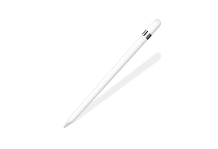
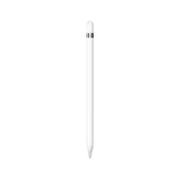
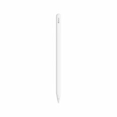
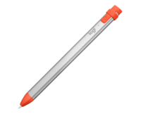

Hola, ¿Que tal?. Hoy vengo a hablar de… El Appel Pencil.

El Apple Pencil es una herramienta muy útil a la hora de dibujar con por ejemplo Procreate y hoy os contare varias cosas sobre el.

1. _¿Para que se puede usar el Appel Pencil?_
2. _Programas compatibles_
3. _Modelos_
4. _Mi experiencia con el_
5. _Alternativas_
6. _Conclusion_

**1.¿Para que se puede usar el Appel Pencil?**

El Appel Pencil tiene muchas utilidades, y cada día se le dan muchas mas a continuación os dejo una lista.

- Dibujar: Existen muchas apps para poder dibujar con el, mi favorita Procreate.
- Escribir: Hace un mes aprox. Se anuncio la compatibilidad de la función de escribir con el pencil en Español. Esta función es compatible con casi todos los huecos para introducir texto, incluso para el WordPress!!!
- Y… Muchos mas usos que se te pueden ocurrir.

**2.Programas Compatibles**

Algunos de los Programas compatibles con el Appel Pencil son estos:

- Notas: Dibujo y Escritura
- Safari: Escritura
- Procreate: Mi favorito cuesta sobre unos 10€ en la App Store pero no tienes que volver a pagar nada, no funciona por suscripción. Ademas es capaz de analizar la presión que hace con el Pencil.
- Adobe Fresco: En este programa tiene que pagar una suscripción mensual que so 10€, si 10€ lo mismo que vale el Procreate y encima Procreate lo pagas una sola vez. De hecho en un comentario de la app Adobe Fresco pone “Atraco a Mano Armada”.
- Otros… Aunque en muchos programas no puedas dibujar puedes usar el pencil como si fuera tu dedo para desplazarte por las apps e incluso escribir.

**3.Modelos**

Actualmente existen dos modelos de Appel Pencil:

1ª Generación (Yo tengo este)

2ªGeneración

Aunque esto también depende del modelo de iPad ya que hay modelos de iPad que no son compatibles con el de 2ªGeneración.

El de segunda Generación es compatible con:

- iPad Pro de 12,9 pulgadas (5.ª generación)
- iPad Pro de 12,9 pulgadas (4.ª generación)
- iPad Pro de 12,9 pulgadas (3.ª generación)
- iPad Pro de 11 pulgadas (3.ª generación)
- iPad Pro de 11 pulgadas (2.ª generación)
- iPad Pro de 11 pulgadas (1.ª generación)
- iPad Air (4.ª generación)

El de primera Generación es compatible con:

- iPad Pro de 12,9 pulgadas (2.ª generación)
- iPad Pro de 12,9 pulgadas (1.ª generación)
- iPad Pro de 10,5 pulgadas
- iPad Pro de 9,7 pulgadas
- iPad Air (3.ª generación)
- iPad (8.ª generación)
- iPad (7.ª generación)
- iPad (6.ª generación)
- iPad mini (5.ª generación)

**4.Mi experiencia**

La verdad llevo como…1 o 2 años con el y no me ha decepcionado, de hecho si pasa todo esto de la pandemia y tenéis ocasión esta muy bien acudir a un [Today at Apple](https://www.apple.com/es/today/) que son los cursos gratuitos que da Appel. Así que si podéis apuntaros a uno no os lo penséis.

Ademas para que lo sepáis tanto el 1ªgeneración como el 2ª se cargan desde el iPad conectándolo por lighting en el caso del 1ª y por inalámbrico en el 2ª, sobre el inalámbrico no lo se pero el 1ª ademas te permite cargarlo directamente con el cable lighting y un adaptador.

**5.Alternativas**

Aunque este articulo valla sobre el Appel Pencil también tengo que hablar de sus competidores y su principal competidor es el:

Logitech Crayon, una de sus diferencias es que no reconoce la presión que ejerces si no que para cambiar la fuerza que haces lo tienes que inclinar. Aunque por lo demás no tiene muchas diferencias ya que usa tecnología similar a la del Appel. Aunque otra diferencia destacable es que tiene un botón para encenderlo y apagarlo.(Es compatible a partir de modelos de iPad de 2018).

**6.Conclusión**

A partir de aquí es vuestra decisión si queréis comprar uno u otro pero yo me decante por el Appel Pencil, pero los dos me parecen grandes productos a continuación os dejo los precios.

1ªGeneración: 99€

2ªGeneraación: 135€

Logitech Crayon: 72€

**Isaaker.**
