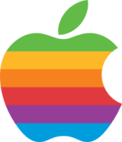
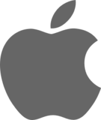
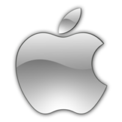
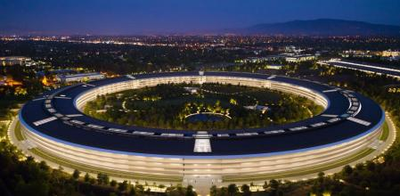
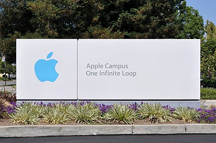
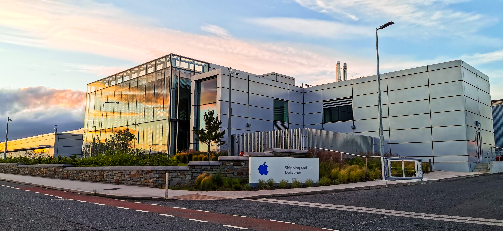

Bienvenido a la pagina acerca de Apple, en ella podrás encontrar mas información sobre esta importantisima compañia tecnológica.

# Mas sobre apple:

## Fundación:

Apple se fundo el 1 de abril de 1976 en Los Altos, California. Sus tres fundadores Steve Jobs, Steve Wozniak y Ron Wayne, le pusieron por nombre Apple Computer.

## Logo:

A lo largo de los años Appel cambio su logo varias veces.

### Primer Logo

### Logo de 1977 a 1998

### Usada desde 1998

### Utilizada entre 2007 y 2013 junto con la Anterior

### Actualidad

### Sus sedes:

Las oficinas centrales se encuentran en Cupertino en el condado de Santa Clara, California, USA (La zona tambien es conocida como Silicon Valley), también cuenta con otra sede cerca de la anterirormente mencionada, esta es el Apple Campus que antes de la construccion de el Apple Park funcionaba como oficina central,  actualmente continua en funcionamiento para algunas tareas administrativas y contiene algunas oficinas y servicios de la empresa.

Ambas sedes tienen varias curiosidades en común, empezando por sus instalaciones ambas cuentan con un auditorio de gran tamaño en el que se realizan presentaciones de la compañia (Park: Steve Jobs Theather | Campus: Apple Town Hall), cafetería con variedad de productos y alimentos e incluso originales tazas de cafe en las que dibujan con leche el logo de la compañia (ambas con el nombre de Caffè Macs), y lo mejor, unas tiendas llamadas "The Company Store" en las que ademas de poder comprar productos son las unicas dos tiendas en el mundo en las que se puede comprar Merchandaising exclusivo de la compañia que se cambian con regularidad.

Por supuesto, la compañia cuenta con muchas más oficinas y campus alrededor del mundo. Algunos de los campus que existen son:

- Austin Campus - Austin, Texas, USA - Operaciones, Ventas y AppleCare
- Cork Campus - Cork, Republica de Irlanda - Sede de operaciones Europeas, Televenta, Apple Store Support, Manufactura, AppleCare, Soporte Técnico, Finanzas...
- Singapur Campus Ang Mo Kio, Singapur, Republica de Singapur - Sede de operaciones Asia-Pacífico, Ingeniería, Departament Legal, Apple Care...
- Elk Grove Campus - Elk Grove, Sacramento, California, USA - Centro de Logística de Apple, en el se almacenan los productos que llegan de las fábricas, en esta sede se montaron los primeros iMac
- Rancho Cordova - Rancho Cordova, Sacramento, California, USA - Centro para soporte a clientes

#### Apple Park

#### Centro de visitantes del Apple Park (Cafe Macs y Store)

El centro de visitantes del Apple Park engloba una cafetería y una store de las que hemos hablado antes y ademas cuenta con una maqueta del Apple Park.

#### Apple Campus

#### Apple Cork Campus

Directores ejecutivos de Apple:

1976: Steve Jobs†

1976-1981: Mike Scott

1981-1983:Mike Markkula

1983-1993: John Sculley

1993-1996: Michael Spindler†

1996-1997: Gil Amelio

1997-2011: Steve Jobs†

2011-actualidad: Tim Cook

Hablando de Números:

Apple Inc es una de las compañías mas ricas del mundo llegando el **1 de marzo de 2021** a mas de dos billones de dólares, llegando a ser la empresa con más valor en Bolsa.

### Variado:

- Una de sus campañas mas importantes fue la de “Think Diferent” (Piensa diferente, en español) y que decia lo siguiente (traducido):

_“Este es un homenaje a los locos. A los inadaptados. A los rebeldes. A los alborotadores. A las fichas redondas en los huecos cuadrados. A los que ven las cosas de forma diferente. A ellos no les gustan las reglas, y no sienten ningún respeto por el statu quo. Puedes citarlos, discrepar de ellos, glorificarlos o villanizarlos. Casi lo único que no puedes hacer es ignorarlos. Porque ellos cambian las cosas. Son los que hacen avanzar al género humano. Y aunque algunos los vean como a locos, nosotros vemos su genio. Porque las personas que están lo suficientemente locas como para pensar que pueden cambiar el mundo… son quienes lo cambian”. Think Different (1997)”_

- Su nombre legal es Apple Inc. sin embargo en España legalmente se llama Apple Retail Spain SL.

- Una cosa muy característica y muy destacada de la compañía es como presentan sus productos, suelen organizar eventos que son notificados con mi poca antelación y que están muy teatralizados. Normalmente se celebran en su teatro (Teatro Steve Jobs) que esta ubicado en el Apple Park.

### Redes sociales:

A continuación os dejo sus redes sociales oficiales:

[Instagram](https://www.instagram.com/apple/)

[FaceBook](https://es-es.facebook.com/apple/)

[YouTube](https://www.youtube.com/channel/UCE_M8A5yxnLfW0KghEeajjw)
