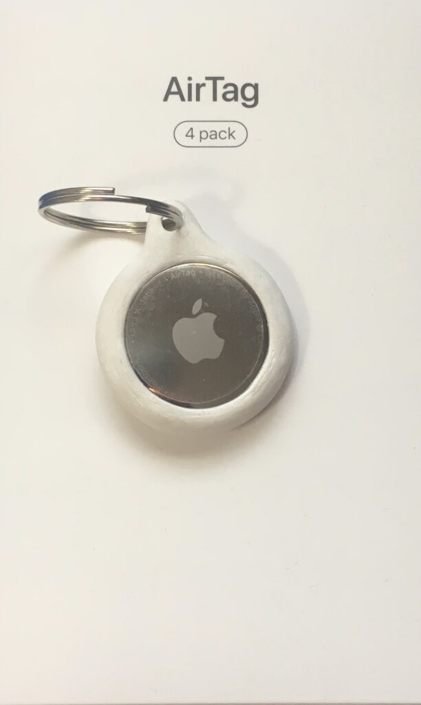

Hola de nuevo, hoy vengo a hablaros otra vez de: Las AirTag, esta vez os hablaré de como funciona su modo perdido y su modo anti rastreo. Ademas os comentaré alguna cosa más sobre ellas, las AirTag.

## Anti Rastreo

Tiene identificadores Bluetooth únicos que cambian con frecuencia. Esto ayuda a evitar que se te pueda rastrear cuando vas de un lugar a otro. Cuando se utiliza la red de la app Buscar para localizar un dispositivo sin conexión o AirTag, toda la información queda protegida con cifrado de extremo a extremo. Nadie, ni siguiera Apple, conoce la ubicación o identidad de ninguno de los usuarios o dispositivos que ayudan a localizar un AirTag que se ha perdido.

AirTag también se ha diseñado para impedir el seguimiento no deseado. Para evitar el rastreo sin tu permiso, la app Buscar te notificará si llevas contigo un AirTag desconocido durante un tiempo. Si un AirTag no está con la persona que lo registró durante un período prolongado, también emitirá un sonido cuando se mueva para que puedas encontrarlo, incluso si no usas un dispositivo iOS.Pero no te preocupes por propias experiencias si se lo prestas a alguien y no esta en modo perdido no sonara sola, tendrás que pulsar sobre la notificación que te aparezca en el teléfono y pulsar la opción que hace que suene, también cuenta con un botón para desactivar las notificaciones indefinidamente.Si tienes activo el modo familia de ICloud te sera posible desactivar las notificaciones indefinidamente pero también durante un dia.

También tengo que mencionar que si tienes activado el Modo Familia de ICloud tu AirTag solo aparecerá en tus dispositivos no se podrá ver desde el de otro miembro solo desde tus dispositivos vinculados con tu cuenta de ICloud.

## Modo Perdido

El modo perdido se usa para que cuando pierdas un objeto ocurra lo siguiente:

- Recibirás un mensaje de confirmación en el correo electrónico de tu ID de Apple.
- Puedes mostrar un mensaje personalizado en la pantalla del dispositivo. Por ejemplo, puedes indicar que has perdido el dispositivo o cómo puede ponerse en contacto contigo la persona que lo encuentre.
- El dispositivo no muestra alertas ni emite sonidos cuando recibes mensajes o notificaciones, o si suena alguna alarma. Sin embargo, todavía puede recibir llamadas de teléfono y llamadas de FaceTime.
- Apple Pay se desactiva en tu dispositivo. Todas las tarjetas de crédito o débito configuradas para Apple Pay, las tarjetas de estudiante y las tarjetas de transporte exprés se suspenderán para tu dispositivo. Las tarjetas de Apple Pay y de estudiante se suspenderán aunque el dispositivo no esté conectado. Las tarjetas de transporte exprés se suspenderán la siguiente vez que el dispositivo se conecte. Puedes reanudar el uso de las tarjetas suspendidas en el dispositivo una vez que lo desbloquees e inicies sesión con tu ID de Apple. Para obtener más información, consulta el artículo del Soporte técnico de Apple [Gestionar las tarjetas que utilizas con Apple Pay](https://support.apple.com/es-es/HT205583).
- En un iPhone, iPad, iPod touch o Apple Watch, verás la ubicación actual del dispositivo en el mapa, así como cualquier cambio. Si el dispositivo tiene desactivados los servicios de localización, estos se activarán temporalmente para poder localizarlo.
- En el caso del Mac, no es posible [localizarlo](https://support.apple.com/es-es/guide/icloud/mmfc0f2442/1.0/icloud/1.0) ni [borrarlo](https://support.apple.com/es-es/guide/icloud/mmfc0ef36f/1.0/icloud/1.0) si no se encuentra cerca de una red Wi‑Fi utilizada previamente, ni puedes cambiar el código para desbloquearlo de forma remota.

Esto no solo funciona con las AirTag sino que también con otros dispositivos de Apple pero eso es otro tema, lo ultimo que mencionaros es sobre el llavero por que seguro que algun@ os habéis preguntado “¿Oye, y ese llavero?” Pues lo he fabricado con una impresora 3D (intentare hacer una entrada acerca de ella) así que eso es todo por esta Entrada.

**Parte de la información a sido obtenida del [Apple Support](https://support.apple.com/es-es)**
