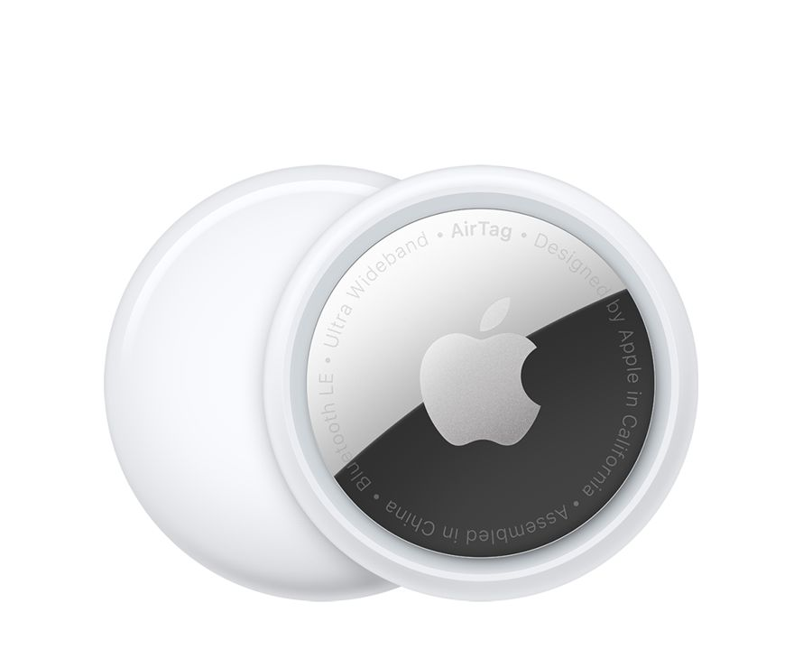

- 
    

Como ya sabréis Apple ha sacado recientemente las nuevas “[AirTag](https://www.apple.com/es/airtag/)”, pues yo ya me hecho con una y en este articulo os cuento mi experiencia y mas sobre ellas.

Las presentaron en el Apple event de Abril 2021 con el lema “Spring Loaded” os dejo a continuación el enlace a la [presentación](https://youtu.be/JdBYVNuky1M) y al [trailer](https://youtu.be/ckqvG0Rj35I). Por si no sabéis su uso es para localizar objetos y tiene las siguientes funciones:

- Localizarla en un mapa
- Se la puede hace reproducir sonidos para encontrarla mas fácilmente
- También cuenta con la función “Modo Perdido”
- Si cuentas con un IPhone de modelo 11 o superior podrás usar la “Búsqueda de Precisión”
- Además cuenta con resistencia de agua y polvo

También existen unos requisitos para poder usarla:

1. ID de Apple
2. Modelos de iPhone y iPod touch con iOS 14.5 o posterior
3. Modelos de iPad con iPadOS 14.5 o posterior

Es Importante mencionar que no viene con el llavero tendrás que comprar o fabricar uno para colgarla, yo en mi caso fabrique un llavero con mi Impresora 3D pero eso ya os lo contare otro día.(Siguiente entrada foto llavero impresora)
