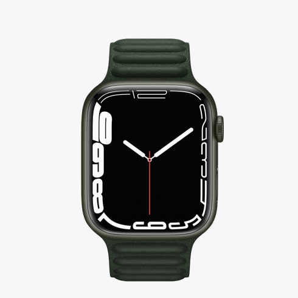

Hola, cuánto tiempo… Se me está amontonando el trabajo tengo que acabar todas estas entradas y ponerme con las de Unleashed el ultimo event a si que…

El ultimo modelo de Apple Watch, el modelo 7 del que vengo a hablaros hoy la verdad es que me dejo sorprendió, ya que muchos esperábamos que pudiera hacer cosas revolucionarias pero como veréis a continuación las mejoras son pocas:

- Pantalla de retina un 20% mas grande (comparando con el Apple Watch 6)
- Bordes un 40% más pequeños (comparando con el Apple Watch 6)
- La pantalla es un 70% mas brillante
- La pantalla se puede ver un poco de lado al estar mas levantada
- Ahora el Apple Watch tiene una calificación IP6X de Polvo
- Y de agua WR50 gracias a su nuevo cristal
- Ademas la batería dura todo el día
- Ahora se a optimizado la carga y el cable de forma de que del 0 al 80% tarda 45 min.
- Y por último habrá nuevos colores Azul Medianoche, Blanco Estelar, Verde, Azul, Rojo (PRODUCT RED), Plata, Grafito, Oro, Titanio natural y Gris Espacial

Pues estas son todas las mejoras en Apple Watch 7, ademas este modelo incluirá WatchOS 8
