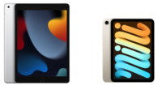

 

Hola, como ya os habréis dado cuenta por él titulo hoy vamos a hablar de los Nuevos iPad.

 

En concreto de el Modelo Normal y del Mini, por que parece ser que no hubo actualización de ninguno de los otros dos modelos.

## iPad (9ªGeneración)

Aunque el iPad Normal no incluye tantas mejoras como el iPad mini, también se a actualizado. A continuación os dejo una lista de las novedades.(Diferencias con el iPad 9ª Generación).

- Chip A13 Bionic  
    con Neural Engine
- Se puede comprar hasta con 256MB
- 12 MpxUltra gran angular frontal
- Peso: El modelo WI-Fi pesa 487 g(Menos que el 9ª Generación WI-FI), y el Modelo WI-FI + Celular pesa 498 g (3 gramos mas que el 9ª Generación WI-FI+ Celular)
- sRGB
- Pantalla True Tone
- Grabación de vídeo en 1080p HD a 25 o 30 f/s
- Zoom de alejamiento x2
    
- Encuadre Centrado
- Rango dinámico ampliado para vídeo hasta 30 f/s
- Grabación de vídeo en 1080p HD a 25, 30 o 60 f/s

No sé si me dejare algún cambio, pero en mi opinion no hay muchas diferencias. Yo personalmente optaría por el Mini, a modo de información una diferencia mala del mini con este. Es la compatibilidad de los teclados, ya que el Mini es compatible con teclados Bluetooth pero no lo es con el Smart Keyboard.

## iPad Mini (6ªGeneración)

Como ya os he dicho el iPad Mini cuenta con muchísimas diferencias tanto con el modelo iPad 9ª Generación como con el iPad mini 5ªGeneración.

- 8,3″Pantalla Liquid RetinaTrue Tone
- Chip A15 Bionic con Neural Engine
- Gran angular de 12 Mpx
- 12 MpxUltra gran angular frontal
- Conector USB‑C
- Descargas ultrarrápidas y streaming en alta calidad (5G)
- Compatible con el Apple Pencil (2.ª generación)
- Compatible con teclados Bluetooth (No Smart Keyboard)
- Dimensiones: **Alto** 19,54cm | **Ancho** 13,48 cm | **Grosor** 0,63 cm | **Peso (WI-FI)** 293g | **Peso (Wi‑Fi + Cellular)** 297 g
- 8,3 pulgadas (en diagonal) retroiluminada por LED con Multi-Touch y tecnología IPS
- Resolución de 2.266 x 1.488 a 326 p/p
- Laminación integral
    
- Película antirreflectante
- Gama cromática amplia (P3)
- Flash True Tone con cuatro LED
- Grabación de vídeo en 4K a 24, 25, 30 o 60 f/s
- Grabación de vídeo en 1080p HD a 25, 30 o 60 f/s
- Rango dinámico ampliado para vídeo hasta 30 f/s
- Vídeo a cámara lenta en 1080p a 120 o 240 f/s
- HDR Inteligente 3 para fotos
- Rango dinámico ampliado para vídeo hasta 30 f/s
- Dos altavoces para un sonido optimizado en horizontal
- Wifi de 6.ª gen. (802.11a/b/g/n/ac/ax); 2,4 y 5 GHz; doble banda simultánea; velocidades de hasta 1,2 Gb/s
- Bluetooth 5.0
- Variedad de Colores: Gris Espacial, Rosa, Púrpura y Blanco Estrella

Haber, sé que esta lista abruma un poco pero si la lees detenidamente veras las diferencias. De todas Formas ahora os dejo las fechas y unos enlaces.

## Comprar iPad (9ªGeneración)

Fecha de Reserva: Ya se encuentra disponible para Reservar

Fecha de Disponibilidad: 24/9

[Pagina del iPad (9ªGeneración)](https://www.apple.com/es/ipad-10.2/)

## Comprar iPad Mini (6ªGeneración)

Fecha de Reserva: Ya se encuentra disponible para Reservar

Fecha de Disponibilidad: 24/9

[Pagina del iPad Mini (6ªGeneración)](https://www.apple.com/es/ipad-mini/)

## Paginas de iPad (General)

[Comparar](https://www.apple.com/es/ipad/compare/)

[Comprar](https://www.apple.com/es/shop/buy-ipad)

[Pagina del iPad](https://www.apple.com/es/ipad/)

Bueno pues esto es todo, muchas gracias por leer el blog y hasta el siguiente articulo.

**Isaaker.**
