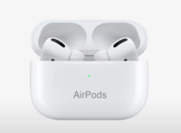

Hola, Buenos dias.

Hoy os vengo a hablar de la sección de AirPods del Apple Event, a continuación os dejo una lista con las nuevas funciones:

- **AirPods**
    - **Conversation Boost**: Esta funcionalidad esta diseñada para gente con leves problemas de escucha, para que puedan mantenerse más conectados a la conversación. Atreves de audio computacional y micrófonos beamforming, amplifica las conversaciones que tienes con gente que esta cerca para que puedas oírles de forma correcta. Ademas para escuchar mucho mejor la conversación puedes reducir el ruido ambiental.
    - **Announce Notifications**: Ahora Siri lee automáticamente tus mensajes y notificaciones por ti , y cuando pones una ubicación para un recordatorio por ejemplo en el supermercado Siri te letra tu lista de la compra cuando lo necesites. Fácilmente puedes elegir que apps quieres activar y seleccionar no molestar cuándo no quieras ser interrumpido. Ademas si usas el modo Focus (enfoque) tus preferencias serán tomadas en cuenta.
    - **Find My ( Buscar)**: Ahora con IOS 15 puedes localizar tus AirPods Pro y AirPods Max usando la red de la app Buscar, simplemente enviar una señal Bluetooth segura que otros dispositivos Apple pueden detectar e interpretar. Ese dispositivo transmitirá el lugar en el que los a detectado y lo enviara a la red, así podrás desde la app buscar dónde están y si están cerca reproducir un sonido que ademas ahora funciona también estando o no dentro del estuche. Si tienes un móvil con compatibilidad del sistema Búsqueda de Precisión podréis usarlo para encontrarlos por este método. Y pensando en que no pierdas tus AirPods ahora si tus AirPods se alejan de ti, tu iPhone te notificara para que revises si te los has dejado en algún lugar.
    - **Spatial Audio**: Ahora la experiencia de Spatial Audio se extiende a tvOS y a macOS, ademas a partir del día 7/6/21 estará disponible Spatial Audio en Apple Music.

Y esto es todo para los AirPods.

**Isaaker.**

