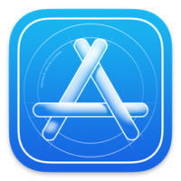

Esta es la ultima entrada, aunque para mucha gente no tenga interés esta sección la tengo que contar ya que esta pagina va sobre esos... sobre tecnología.

- **Apple Developer**
    - **APIs:**
        - Object Capture: Es una nueva API revolucionaria en macOS creada para poder crear objetos 3D que en vez de llevar semanas como podría llevarlo si lo hicieras manualmente, usa "photogrammetry" para convertir imágenes en 2D a objetos 3D en tan solo unos minutos.
    - **Swift:**
        - Concurrency: Concurrency es una de las funciones mas solicitadas en Swift, y es esencial para construir apps que responden mal aporte del usuario mientras trabajo en el fondo, también facilita escribir código que trabaja paralelamente. 
    - **App Store:**
        - Paginas de productos de las apps: Este año podrás crear multiples paginas de productos personalizadas, para mostrar diferentes funciones de tu app para diferentes usuarios. También puedes intentar diferentes capturas de pantalla, videos e incluso iconos de la app, para entender que le gusta más a tus usuarios.
        - In-App Events: Con eventos dentro de las app los eventos y otros contenidos dinámicos por tiempo limitado de dentro de las apps serán puestos en el centro de la App Store, para que los usuarios no se lo pierdan. He incluso esta sección también la podrás integrar en la pagina de la app.
    - **Xcode Cloud:** Esta nueva herramienta simplifica el flujo de trabajo de desarrollo de una app uniéndolo todo, cuando tú creas un cambio en el código Xcode Cloud puede construir la app automáticamente, cómo esta construida en la nube. Tu Mac esta libre para hacer otras tareas y para equipos cada uno puede ver si el cambio presenta errores. Después Xcode ejecuta tus pruebas automatizadas en paralelo, y cuando todo esta listo. Xcode Cloud puede distribuirla a la gente de tu equipo que tiene que probarla e incluso a usuarios beta externos con TestFlight.
    - **Test Flight:** Ahora Test Flight esta disponible para Mac.

Y esto ha sido todo sobre la sección de Apple Developers, no olvides leer la conclusion.

**Isaaker.**

