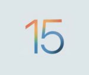

Hola, ¿Que tal?. Hoy vengo a hablaros de la WWDC21 en esta entrada encontrareis información sobre IOS 15.

Se ha celebrado hace poco, exactamente el dia 7 de Junio, y os traigo una lista de los productos, servicios y actualizaciones que ha traído con el.

- IOS 15

- - **FaceTime:**
        - FaceTime link: Con este sistema podrás generar Links a salas de FaceTime, a las que podrás acceder desde cualquier dispositivo aunque no sea de la marca Apple.De hecho este link se puede poner en sitios como Apple Calendar.
        - Voice isolation: Esta opción nos permite omitir ruidos de fondo en las llamadas como puede ser… Una aspiradora.(En el video usan un sopla hojas).
        - Share Play: Con este modo podrás ver o escuchar Muscia y Películas en vivo con tu familia (por ejemplo) a través de FaceTime he incluso podrán pausar también cuando ellos quieran!!! , y le mejor de todo es que también contara con la capacidad de compartir pantalla. Esta función ademas de funcionar con App de Apple, cuenta con un API de facial adopción que otras apps podrás usar para que esta función este disponible. Algunas de las Apps que colaboran en el proyecto son: Disney +, Hulu, HBO Max, NBA, Twitch, Tik Tok, Master Class, ESPN+, Paramount + o Pluto TV.
    
    - **Messages (Mensajes en español):**
        - Ahora la app Mensajes contará con una nueva forma de apilar las imágenes que mandas, creara un Collage o también las agrupara de forma que las puedas ir pasando y cuando pinches te las muestre todas.
        - Shared with You: Parte de esta función solo estará disponible en los países que cuenten con el servicio "News" de Apple (La parte del servicio que no esta disponible en España estará marcada en verde), si alguien me manda una noticia de Apple News pero ahora mismo no la puedo leer esta función lo que hace es añadirlo a una sección especial de la app News llamada Shared with You, para que pueda leerlo mas tarde. Sin embargo esto no se queda aquí también tiene compatibilidad con otras apps de Apple como Música, Safari, Apple TV, Apple Podcast y Fotos.
    
    - **Notificaciones:**
        - Notification Sumary: Esta función lo que hace es que para que el centro de notificaciones no se llene de notificaciones, lo que hace es que agrupa todas las notificaciones en una misma pila y con la inteligencia de tu teléfono las coloca por prioridad. Las notificaciones de personas no serán enviadas a el sumario para que no te pierdas los mensajes importantes.
        - No molestar:
            - Mensajes: Ahora cuando actives el modo no molestar, también se mostrara en tus chats de Mensajes y si alguien te escribe en ese momento se le recordara. Sin embargo si es un mensaje realmente importante habra una forma de trasmitirlo.
            - Focus: Con Focus solo tendrás que elegir en qué quieres centrarte. Podrás por ejemplo preparar un modo para el trabajo u otro para tu vida personal, al configurar un Focus lo que haces es elegir de quien o de que app quieres permitir las notificaciones, como por ejemplo si estas trabajando no recibir notificaciones de un juego. Ademas cuando activas un Focus desde un dispositivo se activa en todos tus dispositivos a la vez automáticamente.
    
    - **Fotos:**
        - Live Text: Con esta función podemos realizarle fotos, por ejemplo a una pizarra y rápidamente copiar el texto y enviarlo por E-Mail. Pero esta función va más allá por qué también funciona con fotos del carrete, o imágenes de mensajes. Con casi todo tipo de imágenes del Sistema e incluso de la web. Comprende siete idiomas entre ellos el Español. De hecho funciona con Mac, iPad y iPhone.
        - Visual Look Up: Tiene un funcionamiento similar a él de Visual Look Up y con un solo toque sobre el objeto u cosa reconocido podremos ver información sobre ello. Esta función funciona con Arte, libros, Naturaleza, mascotas y puntos de referencia.
        - Memorias: Memorias selección de forma automática tus momentos favoritos y uniendo fotos y videos crea pequeñas películas, se crearan de forma automática pero podrás editarlos hasta que queden como a ti te gusta. Y lo mejor de todo es que introduce compatibilidad con Apple Music, con lo que podrás incorporar a tu video canciones de las que se encuentran disponibles en Apple Music.

 

- - **Spotlight:** Ahora Spotligth usa la inteligencia de Fotos para poder encontrar rápidamente desde su búsqueda imágenes de lugares, personas , etc..., y aprovechando Live Text puede incluso encontrar texto en tus fotos. En la búsqueda de Spotlight antes podías buscar contactos, pero ahora te muestra un acceso rápido a unos botones para poder realizar llamadas o escribir a un contacto rápidamente e incluye inteligentemente todo lo relacionado con ellos, como ubicación en Buscar o fotos compartidas ente otros..., ademas ahora se ha incluido resultados enriquecidos nuevos para: Actores, Películas, Músicos...
    - **Wallet:** 
        - Llaves:
            - HomeKit: Pues en la sección de Wallet se hablo de las futuras llaves de casa en el teléfono, Pues si harán una llave compatible con HomeKit que podrás usar para desbloquear las cerraduras compatibles.
            - Pase Corporativo: Pero no se conformaron con solo presentar esto sino que también presentará tarjetas de acceso para poder entrar a el lugar en el que trabajas ( posiblemente mediante NFC).
            - Hotel: Y también donde viajas, podrás recibir automáticamente tu clave cuando tu habitación ya este lista incluso antes de llegar a el Hotel.
            - ¿Qué empresas lo implementaran?: Pues la verdad es que la lista es bastante grande: World of Hyatt, LenelS2, Proxy, TouchNet, Kastle Systems, Atrium, Evergreen, Dormakaba, Allegion, Aqara, Latch, Transact, Salto, Cbord, Schlage, Legic, Walt Disney World, Assa Abloy y Hid. Fueron los mencionados en el Evento.
        - Identificación: Esta función solo se encuentra disponible en Estados Unidos y en los Estado que forman parte del programa, pero es interesante de mencionar y es que podrás llevar el Carnet de Conducir en el Móvil.(Aunque esto en España esta disponible través de la app D.G.T.).
    - **Tiempo:**
        - Cambiaran el diseño a uno mas bonito y que cambiaran según el tiempo que haga, que ademas cambiara según el tiempo que haga, habra también nuevo gráficos para que el usuario entienda mejor la información.
        - La actualización también traerá consigo unos nuevos mapas en alta resolución el los que podremos ver precipitaciones, temperatura y cálida del aire.
    - **Mapas:**
        - Los nuevos mapas en los que se ven los edificios 3d ahora también estarán disponibles en España y Portugal (por una vez se acuerdan de nosotros), y puedo confirmaros que hoy ya están disponibles.
        - Ademas se le ha lavado la cara a Maps y ofrecerá más funciones como elevación en el iPhone.
        - Se ha mejorado la pestaña de Transporte Publico, y se ha incorporado un nuevo sistema de aviso para cuando tengas que bajar.
        - No se me puede olvidar mencionar un sistema tridimensional que escaneara tu entorno y te dará indicaciones pero tristemente no esta disponible en España.
        - Por ultimo a la hora de conducir implementara mas detalles como los carriles bici, pases peatonales, o la superposición de los puentes.
        - Todo esto estará disponible para CarPlay a finales de este año
    - **Otros:**
        - Nuevos atuendos para el Memoji
        - Búsqueda por voz en Safari

 

Pues si el Event a traído varias actualizaciones consigo, estas actualizaciones estarán disponibles en el siguiente orden:

- Beta para desarrolladores: Lunes 7 de Junio de 2021
- Beta publica: Julio 2021
- Actualización publica: Otoño de 2021

Posiblemente la Actualización Publica salga mas o menos a la vez que la Nueva Gama de productos.

Los nuevos mapas 3d de Apple ya están publicados.

**Isaaker.**

 

