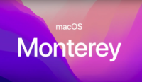

Hoy vengo con el penúltimo articulo (sin contar la conclusion) sobre la WWDC de 2021.

- **macOS**
    - **Continuty:** 
        - Universal Control: Con Universal Control ahora puedes usar solo un teclado y un raton para moverte entre tu Mac e iPad, pero va más allá funciona con más dispositivos. Podrás desplazar los objetos entre dispositivos como si todos fueran uno, pero cada uno seguirá teniendo sus propiedades. Las funciones del iPad seguirán funcionando, y esto se podrá hacer entre iPads, Mac. Por ejemplo yo tengo una foto en el iPad y quiero pasarla al MacBook para agregarla a mi Presentación, pues solo tengo que colocar ambos dispositivos uno al lado del otro y desplazar la imagen a mi diapositiva. Si continuación quiero pasar la presentación a mi iMac, pues la arrastro a mi iMac que estará colocado al lado.
    - **AirPlay:** Ahora podrás hacer AirPlay a la pantalla de tu Mac, tendrá un funcionamiento similar al que ya se usa hoy en día con los Apple TV. Con lo que a muchos ya os resultara familiar.
    - **Atajos:** Muchos diréis este tío se a equivocado de articulo, pues no este año Atajos llega al Mac y trae consigo todas las funcionalidades de la misma app en iOS y iPadOS. Contara con su propia galería de Atajos per-construidos especialmente para Mac, y ademas podrás agregar al Dock Atajos (Igual que en el iPhone y iPad!!!).A modo de información Automator seguirá siendo soportado y se podrán importar flujos de trabajo de Automator a Atajos.
    - **Safari:** A Safari se le ha realizado una buena reforma, todo a empezado por retirar la barra de herramientas y todos sus elementos esenciales han sido colocado en un único botón, ahora las pestañas son mas compactas y modernas, se ha creado una nueva forma de usar pestañas con "Grupos de Pestañas". Pero va mas allá en el iPad funcionara igual que en le Mac, sin embargo en el iPhone... Han hecho algo aun mas especial!!!, ahora la barra de herramientas esta escondida en la parte inferior del teléfono dejando más espacio para la visualización de la pagina. Sin embargo solo necesitaras un toque para verla, y solo deslizarla hacia los lados para moverte entre tus pestañas. Cuando llegas al final de las pestañas solo tienes que deslizar para crear una nueva. Pero hay una ultima funcionalidad y es... Extensiones antes las extensiones para Safari solo estaban disponibles para el Mac, sin embargo ahora también estarán disponibles para el iPad y el iPhone.

Esto es todo para macOs Monterey, el siguiente es el ultimo articulo (sin contar la conclusión así que... Hasta la Proxima!!!.(No sé porque escribo las exclamaciones como los ingleses).

**Isaaker.**

