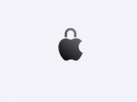

Perdonar por no haber escrito esta semana pero es que llevo una semana muy liado… y ya sabéis. Hoy vengo a hablaros de la sección de Privacidad de la pasada WWDC21.

- **Privacidad**
    - **Mail:**
        - Mail Privacy Protection: Esta función oculta tu dirección IP al abrir correos para evitar que puedan saber si abristeis el correo o no, donde, con que IP y cuando. Esta medida de seguridad se integrara para evitar los Píxeles de Rastreo.
    - **Safari:**
        - IP Oculta: Como en correo, ahora safari ocultara tu IP para evitar que los rastreadores la puedan vincular contigo y saber tu ubicacion.
    - **App Privacity Report:** Esta nueva sección de la app Ajustes permitirá ver un resumen de como las apps, tratan tu privacidad, puedes ver también un historial de cuando las apps usan los permisos que tu les concedisteis en los últimos 7 días. Ademas para averiguar con quien es posible que este compartiendo tus datos, puedes ver con todas las paginas de terceros que contacta.
    - **Siri:** A partir de ahora todo el audio de tus interacciones con Siri sera procesado en el mismo dispositivo así evitando al grabación indeseada de audio, ademas estos va mucho más allá de la privacidad a partir de ahora podrás hacer muchas de tus solicitudes sin conexión a internet, sumándole que así sera mucho mas rápida.

La verdad esta sección a sido corta pero me ha gustado mucho a si que espero que a vosotros también.

**Isaaker.**

