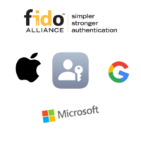

Hola, de nuevo lectores. Llevo bastante tiempo sin escribir una entrada y ya era momento de crear una nueva, el tema que traigo hoy a la web trata sobre las nuevas Apple Pass Keys y la Alianza FIDO.

Desde la ultima y reciente actualización (iOS 16, MacOS Ventura y iPadOS 16) Apple a incluido un nuevo sistema de Autenticación llamado Apple Pass Keys, este sistema se basa en las ya conocidas claves publica y privada. Pero... ¿Por que es seguro realmente este sistema?:

- Siempre es fuerte y nunca es adivinable por parte un hacker
- Solo se vincula al sitio web o la app para el que se creó, de modo que te protege frente a los engaños para que uses una llave de acceso para iniciar sesión en un sitio web o app fraudulento.
- El Dispositivo guarda tu llave de acceso en el llavero de iCloud, así que está disponible en otros dispositivos en los que has iniciado sesión con tu ID de Apple (A partir de las versiones de Sistema Operativo que ya hemos comentado).
- Tiene encriptación de punto a punto en el llavero de iCloud, así que nadie —ni siquiera Apple— puede leerla.
- La clave privada nunca sale de tus dispositivos, de modo que no se puede filtrar desde sitios web o apps.
- No tienes que crear, proteger ni memorizar nada relacionado con ella.
- Puedes usar AirDrop para compartir de forma segura una llave de acceso con otra persona.
- Puedes usar una llave de acceso en el iPhone para iniciar sesión en una cuenta en dispositivos ajenos a Apple (mediante la camara).

En cuanto a los requisitos son solamente 4:

- Tener una cuenta de iCloud (logicamente)
- Tener activada la autenticación de Doble Factor
- Tener habilitado el Llavero de iCloud
- Y tener un dispositivo con las versiones de software compatibles con esta función (iOS 16, MacOS Ventura y iPadOS 16)

He aqui la cuestión, ¿Y que pasa con el resto de dispositivos ajenos a Apple? ¿Y Google? ¿Y Microsoft?. Bueno pues como ya ponia en el titulo de la entrada, existe una Alianza llamada FIDO (Fast IDentity Online):

En esta alianza podemos encontrar a grandes compañias como: Apple, Google, Microsoft, Amazon, 1Passsword, intel, LastPass, Meta, Mastercard, PayPal... la lista completa la podeis leer [aqui](https://fidoalliance.org/members/) ya que no me parece util daros una lista con todos. Sin embargo el 5 de Mayo de 2022, Apple, Microsoft y Google, llegaron a un acuerdo para integrar un estandar de inicio de sesión creado por la FIDO alliance en sus sistemas operativos.

Por tanto no solo Apple va a integrar este sistema en sus dispositivos, si no practicamente todos los dispositivos de otras compañias.

 

En cuanto a el uso de estas Pass Keys, Apple indica en uno de sus articulos que "Las llaves de acceso son un estándar de seguridad empleado en todo el sector, y muchos sitios web y apps están añadiendo rápidamente compatibilidad con este mecanismo". Sin embargo de momento, no he sido capaz de encontra ninguna pagina que que haya integrado este sistema.

Aunque si quereis probar el sistema, podeis usar [esta web](https://webauthn.io/) que es simplemente una demo del sistema, también os dejo este [video](https://www.youtube.com/watch?v=zqSWmBarmGQ) del canal en el que podeís ver el uso practico de las Passkeys.
