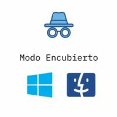
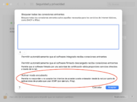
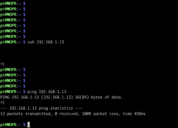

Bueno, hoy vengo a hablaros de un curioso modo del FireWall de mi Mac que muchos seguramente no conozcais: **Modo Encubierto**

En sus propias palabras este sistema: "Permite no responder o no aceptar los intentos de acceder a este ordenador desde la red por parte de aplicaciones de prueba que usan ICMP (Por ej: Ping)". Ahora preguntareís ¿cual es tu opinión sobre este sistema?, pues que funcióna muy bien para que lo podais ver os dejo unas capturas a continuación.

En esta imagen veís los ajustes de Firewall, y señalado en rojo este del que os estoy hablando. Es importante mencionar que para entrar a estos ajustes necesitas una clave de Administrador.

Y en esta otra imagen vemos que al intentar conectarnos a el Mac, no responde a la señal. También probamos Ping sin respuesta, pero es curioso por que además no da un error Host is down si no que simplemente no responde.

Bueno pues como podeís ver ninguna otra maquina es capaz de determinar si en realidad aquí hay una maquina o no. Ahora os preguntareis, ¿Y para que es util esto?, bueno pues por ejemplo si usais vuestro Mac en una red Wifi Publica es muy buena idea activar esta medidas para evitar los ciberataques. Aunque sabeís que siempre recomiendo usar los datos del telefono como Wifi.

Por ultimó algunós preguntareís ¿Y windows cuenta con un modo así?, Pues si. [Fuente](https://support.microsoft.com/es-es/windows/firewall-y-protecci%C3%B3n-de-red-en-seguridad-de-windows-aef9838b-d081-fd75-3b1b-e5fa794c003b)

Desde el centro de Seguridad de Windows Defender, existe una seccion llamada Firewall & Network Protection.

En ella nos dice que hay tres tipos de red:

- Redes de dominios (área de trabajo)
- Redes privadas (reconocibles)
- Redes públicas (no reconocibles)

Y al seleccionar uno, nos mostrara a que red de ese tipo estamos conectado actulmente. Ahora os explicare en que consiste el "modo encubierto" de este sistema.

Lo que hace Windows es en Redes Privadas (La de tu casa por ejemplo), desactiva el modo encubierto dejando visible tu dispositivo, ya que normalmente el resto de dispositivos que habra seran tuyos o de la persona que conozes. Sin embargo en una red "Publicá" por ej: Un centro comercial, el ordenador considerara que va a convivir con ordenadores de personas que no conoce, entonces activara el modo "no reconocible" para que otros ordenadores no puedan "descubrirte" o verte.

Por supuesto todos estos modo traén ajustes que puedes cambiar a tu gusto.

Y eso es todo por hoy, os dejo a continución unos enlaces a los soportes tecnicós por si tenis alguna duda. Y hasta el proximo articuló.

MacOs: [https://support.apple.com/es-es/HT201642](https://support.apple.com/es-es/HT201642)

Windows: [https://support.microsoft.com/es-es/windows/firewall-y-protecci%C3%B3n-de-red-en-seguridad-de-windows-aef9838b-d081-fd75-3b1b-e5fa794c003b](https://support.microsoft.com/es-es/windows/firewall-y-protecci%C3%B3n-de-red-en-seguridad-de-windows-aef9838b-d081-fd75-3b1b-e5fa794c003b)
