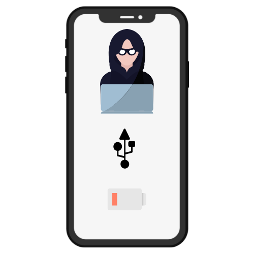

Hola, sé que llevo un tiempo sin escribir sin embargo hoy me ha venido a la cabeza un tema muy interesante: ¿Es realmente seguro cargar mi móvil en un lugar publicó, a que me expongo?.

La respuesta es No del todo, te estas exponiendo a una técnica llamada Juice Jacking. A ver no os alarméis simplemente antes de conectaros a una fuente de alimentación de este tipo tomad las medidas oportunas.

Conectándonoslos a estos puertos USB, que podemos encontrar en lugares públicos o incluso en coches de alquiler. Nos exponemos a que: Se pueda acceder a algunos datos de nuestro teléfono, se nos transfiera algún tipo de [Malware](https://es.wikipedia.org/wiki/Malware) o en los peores casos que tome el control de nuestro teléfono.

Estos puntos son una muy buena idea, pero si queréis otra alternativa os dejo unas a continuación:

\-Batería Externa, Son fáciles de conseguir y una nos puede costar sobre 20€, ademas esto nos daría la opción de movernos mientras cargamos.

\-Llevarte tu propia adaptador USB, lo que puedes hacer es ademas de llevar tu cable llevarte el adaptado USB o Transformador.

\-Escudo USB o Data Blocker: Estos pinchos tienen dos entradas, una USB que enchufarías al puerto y otra para colocar tu cable de alimentación. Lo que realiza esta especie de pendrive es la tarea de solo permitir el paso de energía, no permitiendo la transferencia de datos.

En caso de que te sea de extremada necesidad:

En el caso de Android activar siempre el modo Solo Carga de las preferencias de USB, al enchufarlo muchos dispositivos iOS ya no permiten montar discos duros externo y en el caso de Android nos preguntara si permitirlo o no. Lógicamente Responderemos NO.

En el mismo caso, algunos abres visto que al enchufar vuestros iPhones a un Ordenador pregunta si confiar o no, si estas realizando la carga en uno de estos puertos y te realiza la pregunta... Responde que NO y personalmente os recomiendo desconectarlo ya que esto resulta bastante sospechoso.

Aunque no quiero resultar insistente os vuelvo a recomendar no conectar vuestro dispositivo por que esta comprobado que ha habido iPhones de ultima generación que han sido infectados en menos de un minuto, e incluso algunos investigadores de seguridad como Jonathan Zdziarski afirman que estos problemas de seguridad pueden perdurar.

Si sufrís un problema de este tipo contactar con profesionales, y por ultimo os recomiendo que intentéis hacer copias de seguridad de vuestro dispositivo de vez en cuando ya que estas podrían salvar el contenido de vuestro teléfono en estos casos.

Hasta la Siguiente

**Isaaker.**
