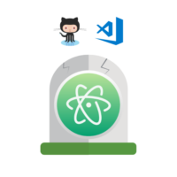

Hola de nuevo, lectores

Hoy os traigo una nueva noticia al blog, como imagino que abres leído en el titulo de la entrada, GitHub hace escasos dias archivo totalmente el proyecto Atom de de forma oficial. Aunque esto ya fue anunciado el 8 de Junio de 2022, el cierre oficial ocurrió el 15 de Diciembre, en su [nota de prensa](https://github.blog/2022-06-08-sunsetting-atom/) Atom da los siguientes motivos:

> Atom no ha tenido un desarrollo significativo de características en los últimos años, aunque hemos llevado a cabo actualizaciones de mantenimiento y seguridad durante este período para asegurarnos de que estamos siendo buenos administradores del proyecto y del producto. A medida que han ido surgiendo y evolucionando nuevas herramientas basadas en la nube, la participación de la comunidad Atom ha disminuido considerablemente. Como resultado, hemos decidido poner fin a Atom para poder centrarnos en mejorar la experiencia de los desarrolladores en la nube con GitHub Codespaces.
> 
> Es una despedida dura. Vale la pena reflexionar que Atom ha servido como base para el marco Electron, que allanó el camino para la creación de miles de aplicaciones, incluyendo Microsoft Visual Studio Code, Slack, y nuestro propio GitHub Desktop. Sin embargo, la fiabilidad, la seguridad y el rendimiento son fundamentales para GitHub, y con el fin de servir mejor a la comunidad de desarrolladores, estamos archivando Atom para dar prioridad a las tecnologías que permiten el futuro del desarrollo de software.

 

En mi opinion personal, Atom es un gran editor, ya sea gracias a todos los paquetes disponibles, la gran integración con git u otras multiples funcionalidades. También creo que el que se halla archivado el proyecto Atom no solo es debido a las pocas contribuciones al proyecto, si no también en parte a la intención de subir las tasas de usuarios de otros servicios de GitHub y Microsoft como Visual Studio Code o Code Spaces. Y que queréis que os diga, creo que lo han conseguido.

 

En resumen, ahora toca pasarse a Visual Studio y por ellos os dejo una pequeña lista de los plugins que mas utiles e interesantes me han parecido a la hora de complementar esta app:

 

- [Soporte para C y C++ y algunos complementos para este lenguaje](https://marketplace.visualstudio.com/items?itemName=ms-vscode.cpptools-extension-pack)
- [GitHub Repos](https://marketplace.visualstudio.com/items?itemName=GitHub.remotehub)
- [GitHub Pull Request and Issues](https://marketplace.visualstudio.com/items?itemName=GitHub.vscode-pull-request-github)
- [Python (Interprete, Ayuda con los errores...)](https://marketplace.visualstudio.com/items?itemName=ms-python.python)

Y por ultimo un pequeño truco, si todavía no lo conocíais. Como sincronizar vuestros Visual Studio (Requiere tener una cuenta de GitHub o Microsoft), de forma que cuando lo uses en otro dispositivo, esta app este ya este adaptada a tu gusto con tus extensiones, temas... favoritos (Los pasos son los mismo aunque ya hayas hecho ya el setup de la app):

1. Abre Visual Studio si todavía no lo has hecho
2. Pulsa el icono de una persona que esta situado en la parte inferior de la barra lateral izquierda
3. Selecciona la opción "Turn On Settings Sync..." o si ya has puesto el idioma en Español la opción "Activar Sincronización de configuración"
4. Ahora, se te muestra un menú desplegable en el que puedes elegir que información de la aplicación quieres sincronizar, yo personalmente tengo todas las opciones activadas.
5. Pulsa el botón Iniciar Sesión y Activar
6. Ahora te preguntara que tipo de cuenta quieres utilizar para sincronizar la información, nosotros lo vamos a hacer con GitHub
7. Ahora deberías de ver un pequeño banner abajo a la derecha, el momento de iniciar sesión es diferente dependiendo de la conexión y ordenador. Hay veces que la propia app te abre una ventana de GitHub para iniciar sesión, pero hay veces que tienes que ser tu mismo el que enlace el dispositivo mediante la pagina web.  En caso de que tarde el proceso mucho, pulsa cancelar y después pulsa si cuando se te pregunte "¿Tienes problemas para iniciar sesión? ¿Deseas probar de otra forma?"
8. Independientemente del proceso que hallas utilizado, ahora se te mostrara una ventana en la que se te informara de que el Modulo de Autenticación de VS Code quiere acceder a algunos datos de tu cuenta y cuales son estos **(Asegurese de que el nombre de la app y hora de la solicitud coincidan con tu petición),** si estas de acuerdo pulsa Authorize.
9. Y, ya esta!!!

 

Y no hay mucho mas que contaros por hoy, nos vemos en la próxima entrada!!!
