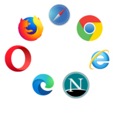
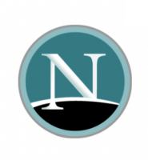

Hoy vamos ha hablar sobre navegadores, empezando por su historia...

El primer navegador del mundo fue creado por Tim-Berners-Lee el padre de el concepto World Wide Web, en sus inicios el navegador tomo el mismo nombre que el mismo concepto anteriormente mencionado sin embargo, se le cambio el nombre a Nexus para evitar confusiones. El problema de este navegador fue la compatibilidad ya que solo funcionaba en los ordenadores NeXT (empresa fundada por Stve Jobs en 1985).

Sin embargo aqui entra en juego una empresa llamada Mosaic Communications Corporation, que en 1994 lanzo un navegador llamado Mosaic Netscape. Este nuevo navegador funcionaba en distribuciones Unix pero pronto se crearon adaptaciones funcionales para Windows y Macintosh. A su vez esta compañia cambio de nombre ese mismo año a Netscape Comunications Corporation, cambiando el nombre del navegador a Netscape navigator.

Y es que en este punto de la historia es donde nació Internet Explorer, el mitico navegador de Microsoft que dejo de ser soportado en algunos windows a partir del 17 de agosto de 2021 y es que este navegador fue muy poderoso ya que llego a conseguir una cuota de 95% del mercado. Ya que la gracia de este navegador era la integracion con Windows.

Tras un tiempo Netscape tiro la toalla y publico el codigo de Netscape Navigator con la esperanza de que se convirtiera en un proyecto de codigo abierto. Naciendo asi el proyecto Mozilla.

Mientras tanto Opera un navegador del que seguramente pocos haberis oido hablar se empezo a diseñar, siendo su primera version lanzada en 1996.

Aunque finalmente Mozilla fue rescrito desde cero y tardo bastante en aparecer, aparecio en 2002  con una buenisima primera version que ademas llego a casi todas las plataformas.

Despues de esto se fueron lanzando un gran numero de navegadores como: Safari (2003), Mozilla Firefox (2004), Google Chrome (2008) o Microsoft Edge (2015).

Me gustaria mencionar que no solo existen navegdores con interfaz grafica como los anteriormente mencionados, si no que podemos encontrar otros que se pueden ejecutar desde el terminal como pueden ser:

- Elinks
- Lynxs
- Links2
- w3m

Por ultimo os quiero algunos detalles de funcionamiento:

Normalmente las comunicaciónes Cliente (navegador en este caso) a Servidor se hacen en HTTP (Hypertext Transfer Protocol) o HTTPS (la version cifrada de HTTP), aunque todos los navegadores suelen soprtar protocolos de trasnferencia de archivos como FTP.

A... y os pido que no equivoqueís los Navegadores con los Buscadores. La diferencia explicada de forma simple es que el Navegador es el software que nos permite conectar con las web de internet y los motores de busqueda, y los motores de busqueda nos ayudan a encontrar esas web a las que conectarnos.

Bueno, pues espero que os halla gustado ... y hasta el proximo articulo.
