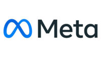

Hola, como ya os he dicho hace un rato... he experimentado algunos problemas del sitio web con Apple Silicon pero parece ser que es culpa de Safari ya que con Firefox funciona, a si mismo a los lectores no os esta repercutiendo hasta donde yo se a si que vamos con otra entrada.

En general a Meta Plataforms la podreis haber visto en el inico de algunas apps como: Facebook, Instagram o Whatsapp. Pero ¿Que es Meta?.

Meta Plataforms es una compañia estadounidense con sede en Menlo Park, aunque anteriormente se conocia como: Facebook Inc. A si que ya os hareis una idea, lo que el publico en general llama Facebook en realidad es Meta.

Junto a Apple Inc., Microsoft Corporation y Alphabeth, esta considerada una de las cinco empresas mas ricas del mundo. Meta fue fundada en febrero de 2004, en Cambridge.

Actualmete es dirigida por **Mark Elliot Zuckerberg** como CEO, ademas de haber sido uno de los cofundadores de la compañia.

Segun fuentes, el nombre Meta proviene del Girego ("Mas alla") y según la compañia su logo _esta destinado a ser visto desde diferentes perspectivas e interactuar con los usuarios. Además de representar a Meta, subraya los infinitos horizontes del Metaverso._

Y es que ultimamente la compañia Meta, esta realizando muchos productos que tienen que ver con la realidad aumentada. Como las gafas Ray-Ban Stories que logran capturar fotos y videos relativamente buenos en cualquier momento sin necesidad de utilizar tus manos. Además, estas gafas funcionan como audífonos Bluetooth para escuchar música, podcast o para utilizar en las llamadas.

Tambien es interesante de que su obsesión por la realidad aumentada les alla llevado a adquirir compañias como Oculus por una cantidad de 2300 millones de dolares, o Beats Games.
