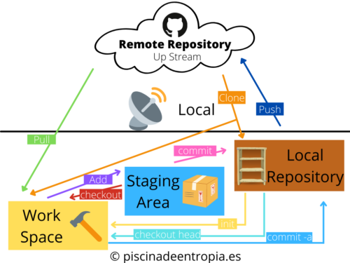

Hola de nuevo, hoy traigo a la web una nueva entrada que tenia en mente hace mucho tiempo. Como ya podeís ver por el título hoy hablaremos de ¿Que es Git?

Para empezar veremos un poco las definición que encontramos en [su pagina web](https://git-scm.com/):

> Git es un sistema de control de versiones distribuido, gratuito y de código abierto, diseñado para manejar todo tipo de proyectos, desde los más pequeños hasta los más grandes, con rapidez y eficiencia.
> 
> Git es fácil de aprender y ocupa poco espacio con un rendimiento rapidísimo. Supera a las herramientas SCM como Subversion, CVS, Perforce y ClearCase con características como la ramificación local barata, cómodas áreas de preparación y múltiples flujos de trabajo.

Por muchas de estas características, Git es usado por millones de Compañias y Desarrolladores alrededor del mundo (además de por GitHub una plataforma de repositorios basada en Git), algunas de estas compañias pueden ser: Google, Facebook, Microsoft, Twitter, LinkedIn o la famosa plataforma Netflix.

Y después de esta breve introducción veremos como funciona Git combinado con [GitHub](https://piscinadeentropia.es/que-es-github/) mediante un esquema creado por mi:

## Zonas

Como podemos ver en el esquema hay 4 áreas, las 3 primeras ubicadas en Local:

1. Work Space (Área de Trabajo): Es la carpeta de nuestro proyecto sobre la que trabajamos normalmente.
2. Staging Area (Área de Preparación): Es el área donde ponemos a git los archivos que queremos que se incluyan en el proximó commit.
3. Local Repository (Repositorio Local): Es el lugar donde se almacenan todos los cambios que se realizan

Y la última ubicada en Up Stream:

4\. Remote Repository (Repositorio Remoto): Este se ubica en alguna plataforma como [GitHub](https://github.com/) o en algun servidor interno. Esto hace que trabajar en grupo sea mas facil ya que todos ponen sus cambio en un mismo sitio y se pueden descargar los del resto.

## Comandos

- Pull: Incorpora los cambios de un repositorio remoto a la rama actual. Si la rama actual está detrás de la remota, entonces por defecto adelantará la rama actual para que coincida con la remota.
- Clone: Clona un repositorio en un directorio recién creado, crea ramas de seguimiento remoto para cada rama del repositorio clonado (visibles usando git branch --remotes), y crea y comprueba una rama inicial que se bifurca desde la rama actualmente activa del repositorio clonado.
- Add: Este comando actualiza el índice utilizando el contenido actual que se encuentra en el árbol de trabajo, para preparar el contenido preparado para el siguiente commit.
- Checkout / Checkout head: Actualiza los archivos en el árbol de trabajo para que coincidan con la versión en el índice o el árbol especificado. Si no se da ninguna especificación de ruta, git checkout también actualizará HEAD para establecer la rama especificada como la rama actual (Basicamente se suele utilizar para cambiar de rama).
- Init: Crear un repositorio Git vacío o reiniciar uno existente.
- Commit / Commit -a: Crea una nueva confirmación que contiene el contenido actual del índice y el mensaje de registro dado que describe los cambios. Commit -a le dice al comando que escale automáticamente los archivos que han sido modificados y eliminados, pero los nuevos archivos que no le ha dicho a Git no se ven afectados.
- Push: Actualiza las refs remotas utilizando las refs locales, mientras envía los objetos necesarios para completar las refs dadas.

Ahora hablaremos un poco sobre la instalación, actualización y os dejare algunos videos de introducción a Git.

Si usas Mac, muchas veces git viene instalado junto a XCode y en Linux también viene muchas veces instalado, para asegurarte de que este esta instalado usa el comando:

`git --version`

En el caso de Mac y si lo tuvieramos instalado nos devolveria: `git version 2.32.1 (Apple Git-133)`

En el caso de Linux se nos devolveria algo como esto: `git version 2.20.1`

## Instalar Git

Para instalar Git puedes acceder a [esta pagina](https://git-scm.com/downloads), y elegir como instalarlo entre las opciones que te ofrece tu Sistema Operativo (Despúes de actualizar usa `git --version`para verificar que se actualizó).

## Actualizar Git

### Linux

Primero actualizamos la info de los repositorios de los paquetes instalados con: `apt-get update`

Y después actualizamos git con: `apt-get install git`

### Windows

Actualizar git en windows es un poco mas dificil, esto depende de que version del mismo tengas (Al igual que antes obtenemos la version con: `git --version`):

- Si git tiene la version 2.14.1 o mas antigua: Desinstala Git e instala la version mas reciente desde la [pagina de descargas oficial](https://git-scm.com/downloads).
- Si tienes entre las versiones 2.14.2 y la version 2.16.1, usa:  `git update`
- En caso de tener la version 2.16.1 o posteriores usa `git update-git-for-window`

### MacOS

Para Mac, aunque no sea la solución que mas me gusta la gente suele usar homebrew para actualizarlo, en caso de no haber usado brew desde el principio nos hara volver a instalar git para despues actualizarlo. Como ya he comentado antes algunas veces git viene junto a XCode por ello sospecho que cuando actualizas XCode también se actualiza git sin embargo no he sido capaz de encontrar nada al respecto en internet.

`/usr/bin/ruby -e "$(curl -fsSL https://raw.githubusercontent.com/Homebrew/install/master/install)"`

`brew update`

`brew install git`

`brew upgrade git`

 

## Videos de introduccion a Git

 

https://player.vimeo.com/video/41027679

https://player.vimeo.com/video/41381741

https://player.vimeo.com/video/41493906

https://player.vimeo.com/video/41516942
