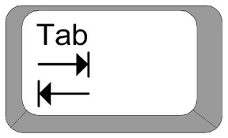

**Python** es un [lenguaje de programación](https://es.wikipedia.org/wiki/Lenguaje_de_programaci%C3%B3n)[interpretado](https://es.wikipedia.org/wiki/Int%C3%A9rprete_(inform%C3%A1tica)) cuya filosofía hace hincapié en la legibilidad de su [código](https://es.wikipedia.org/wiki/Codigo_fuente).[2​ Se trata de un lenguaje de programación](https://es.wikipedia.org/wiki/Python#cite_note-Glosario_LUCA,_2020-2) [multiparadigma](https://es.wikipedia.org/wiki/Lenguaje_de_programaci%C3%B3n#Paradigma_de_programaci%C3%B3n), ya que soporta parcialmente la [orientación a objetos](https://es.wikipedia.org/wiki/Programaci%C3%B3n_orientada_a_objetos), programación imperativa y, en menor medida, [programación funcional](https://es.wikipedia.org/wiki/Programaci%C3%B3n_funcional). Es un [lenguaje interpretado](https://es.wikipedia.org/wiki/Lenguaje_de_programaci%C3%B3n_interpretado), [dinámico](https://es.wikipedia.org/wiki/Tipado_din%C3%A1mico) y [multiplataforma](https://es.wikipedia.org/wiki/Multiplataforma).

Es administrado por la [Python Software Foundation](https://es.wikipedia.org/wiki/Python_Software_Foundation). Posee una licencia de [código abierto](https://es.wikipedia.org/wiki/C%C3%B3digo_abierto), denominada [Python Software Foundation License](https://es.wikipedia.org/wiki/Python_Software_Foundation_License).

Acerca de sus peculiaridades: Aunque podemos usar un IDE como es por ejemplo el que uso yo en mi Rapsberry pi 400 es Thony Python IDE, aunque hay muchos mas. Es que hay que tabular ¿Tabular? Pues si esta tecla:



Se pueden utilizar tanto espacios como tabuladores para sangrar el código, pero se recomienda no mezclarlos. Cada vez que tienes que sangrar te lo hace automáticamente el IDE pero si no lo usas os pongo un ejemplo.(Cada vez que sangras es un tabulador).El sangrado solo se usa cuando tienes que ejecutar algo en un bucle o con if o else, también con While True.

```
print(“¡Empieza el Bucle!”)
for i in range (10):
     print(“Numero de Bucle”, i)
print(“Acabó el Bucle”)
print(“···END OF THE PROGRAM···”)
print(“Este bloque de código a sido obtenido de piscinadeentropia.es”)
```

También contaros una cosa mas 5 espacios = 1 tabulador, ¿Por que os digo esto? Pues por que hay sitios que no te dejan usar las tecla de tabulador como por ejemplo WordPress :( . Si por ejemplo hago un bucle dentro de un bucle, tendré que ponerlo así.

```
name = input(“¿Cuál es tu nombre?”)
if name == (“Pepe”):
     age = input(“¿Edad?”):
          if Age == (“100”):
               print(“Ok”)
          else:
               print(“Vale”)
else:
     print(“No te conozco”)
print(“···END OF THE PROGRAM···”)
print(“Este bloque de código a sido obtenido de piscinadeentropia.es”)
```

Aunque una de las cosas que mas me gusta es que cuenta con muchos Módulos, podéis ver una lista de los que existen [aquí](https://rico-schmidt.name/pymotw-3/py-modindex.html).

Entradas acerca del Tema:
