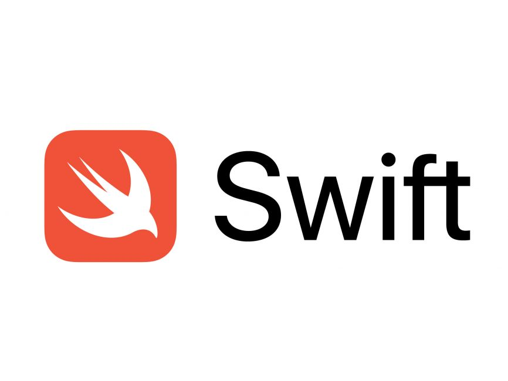

[Swift](https://swift.org) es un Lenguaje de Programación basado en Objetive-C, Pyhton, Ruby... Desarrollado por Apple Inc. Este lenguaje se usa para el desarrollo de Apps, en MacOS, iPadOS, iOS, tvOS y todos los sistemas operativos de Apple que permitan las apps. Su desarrollo lo comenzó Chris Lattner en 2010, y fue presentado en la WWDC de 2014, es importante mencionar que es de código abierto bajo la licencia Apache 2.0.

Ademas es curioso mencionar que el otro día lei que Siri estaba programada en Objetive-C, y eso me genera una pregunta...¿Entonces esta programada en Swift?.

Para los que os intereséis por este Lenguaje, os puedo contar que podéis aprender a usarlo de la mano de Apple con [Swift Playgrounds](https://www.apple.com/swift/playgrounds/). Una app totalmente Gratuita, disponible de momento para  iPadOS y MacOS.(Lo siento pero no se encuentra disponible para ningún dispositivo mas).

Esta app enseña de una forma muy interactiva y entretenida a programar, y ademas intenta siempre que entiendas los conceptos.

Y eso es todo por hoy, ya sabéis que atendemos vuestras dudas en el [correo de la web](mailto: piscinadeentropia.es@gmail.com) y que podéis uniros si no lo estáis al [canal de Telegram](http://t.me/piscinadeentropia.es) en el que os ire notificando el contenido nuevo.

