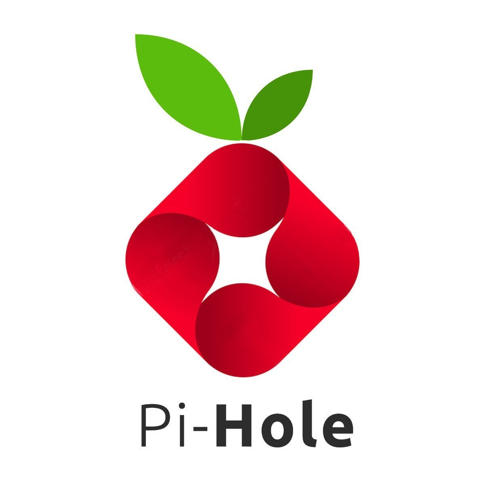

Pi-hole es un DNS que filtra las peticiones y deniega las peticiones sospechosas, anuncios, malware, webs peligrosas y demás..., es compatible con multiples sistemas operativos Linux y también cuenta con una version docker, lo que destaca de pi-hole es que no se ejecuta en el equipo local si no que se ejecuta en una maquina remota dentro de la red y lo único que hay que hacer es modificar el DNS en nuestro router o en nuestro equipo.
