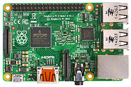
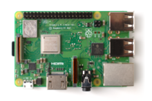
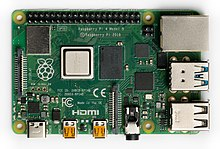
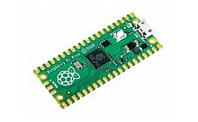
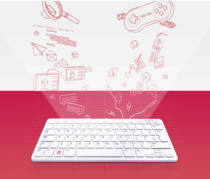

## ¿Qué es una Raspberry Pi?

La **Raspberry Pi** son unos ordenadores de placa única u ordenadores de placa simple (SBC) de bajo coste desarrollado en el Reino Unido por la [Raspberry Pi Foundation](https://www.raspberrypi.org/), con el objetivo de poner en manos de las personas de todo el mundo el poder de la informática y la creación digital.

En el 2006, los primeros diseños de Raspberry Pi se basaban en el microcontrolador Atmel ATmega644. Sus esquemas y el diseño del circuito impreso están disponibles para su descarga pública.

En mayo de 2009, la fundación Raspberry Pi fue fundada en Caldecote, South Cambridgeshire, Reino Unido como una asociación caritativa que es regulada por la comisión de caridad de Inglaterra y Gales.

El administrador de la fundación, [Eben Upton](https://es.m.wikipedia.org/wiki/Eben_Upton), se puso en contacto con un grupo de profesores, académicos y entusiastas de la informática para crear un ordenador con la intención de animar a los niños a aprender informática como lo hizo en 1981 con el ordenador Acorn BBC Micro.

## Lista de Modelos

<table style="border-collapse: collapse; width: 100%;"><tbody><tr><td style="width: 10.8827%;"><strong>Modelo</strong></td><td style="width: 6.28779%;"><strong>Fecha</strong></td><td style="width: 33.0109%;"><strong>Precio</strong></td><td style="width: 49.5768%;"><strong>Caracteristicas</strong></td></tr><tr><td style="width: 10.8827%;">Raspberry Pi 1 Modelo A</td><td style="width: 6.28779%;">2012</td><td style="width: 33.0109%;">40 Euros</td><td style="width: 49.5768%;">Sin Ethernet , un puerto USB y SD (Descontinuada)</td></tr><tr><td style="width: 10.8827%;">Raspberry Pi 1 Modelo B</td><td style="width: 6.28779%;">2012</td><td style="width: 33.0109%;">40 Euros</td><td style="width: 49.5768%;">Con Ethernet , dos puertos USB y SD (Descontinuada)</td></tr><tr><td style="width: 10.8827%;">Raspberry Pi 1 Modelo B+</td><td style="width: 6.28779%;">?</td><td style="width: 33.0109%;">?</td><td style="width: 49.5768%;">4 puertos USB y MicroSD</td></tr><tr><td style="width: 10.8827%;">Raspberry Pi 2 Modelo B</td><td style="width: 6.28779%;">2014</td><td style="width: 33.0109%;">Aprox. 43,95 €</td><td style="width: 49.5768%;">1GB, 40 pines GPIO, 4 puertos USB y Suprime la conexión RCA.</td></tr><tr><td style="width: 10.8827%;">Raspberry Pi 3 Modelo B</td><td style="width: 6.28779%;">2016</td><td style="width: 33.0109%;">Aprox. 40,23</td><td style="width: 49.5768%;">Introduce compatibilidad con WI-FI y Bluetooth</td></tr><tr><td style="width: 10.8827%;">Raspberry Pi 3 Modelo B+</td><td style="width: 6.28779%;">2018</td><td style="width: 33.0109%;">He visto una a 32,95</td><td style="width: 49.5768%;">Ahora incorpora doble banda a 2,4GHz y 5GHz, nuevo puerto ethernet y Bluetooth 4.2</td></tr><tr><td style="width: 10.8827%;">Raspberry Pi 3 Modelo A+</td><td style="width: 6.28779%;">2018</td><td style="width: 33.0109%;">?</td><td style="width: 49.5768%;">presentan menores prestaciones a un menor precio. Cuenta con 512 MB de RAM , un solo puerto USB y sin puerto de conexión de red por cable.</td></tr><tr><td style="width: 10.8827%;">Raspberry Pi 4 Modelo B</td><td style="width: 6.28779%;">2019</td><td style="width: 33.0109%;">?</td><td style="width: 49.5768%;">Se han cambiado el puerto HDMI por dos MicroHDMI, un solo puerto USB y sin puerto de conexión de red por cable. (Logicamente su coste es menor).</td></tr><tr><td style="width: 10.8827%;">Raspberry Pi 400</td><td style="width: 6.28779%;">2020</td><td style="width: 33.0109%;">Dependiendo de como la compreis, se puede comprar individualmente (Solo la Pi) o con el Personal Computer Pack.Yo compre este ultimo y es el que os recominedo.<a href="https://piscinadeentropia.es/raspberry-pi-400/"> Lee mas en este articulo</a>.</td><td style="width: 49.5768%;">Es curiosa ya que en le interior esta basada en una Pi 4 pero, tiene una carcasa, con teclado. Y ademas si compras el pack especial incluye mas cosas. En general funciona con una MicroSD, dos MicroHDMI, WI_FI, Dos Puertos USB 3.0 y Uno 2.0 , puerto Ethernet, GPIO y por ultimo Hueco para un candado de los de portatiles. <a href="https://piscinadeentropia.es/raspberry-pi-400/">Leer Mas...</a></td></tr></tbody></table>

## Raspberry Especiales

<table style="border-collapse: collapse; width: 100%;"><tbody><tr><td style="width: 16.0822%;"><strong>Modelo</strong></td><td style="width: 6.28779%;"><strong>Fecha</strong></td><td style="width: 15.5985%;"><strong>Precio</strong></td><td style="width: 61.9105%;"><strong>Caracteristicas</strong></td></tr><tr><td style="width: 16.0822%;">Raspberry Pi Zero</td><td style="width: 6.28779%;">2015</td><td style="width: 15.5985%;">5$</td><td style="width: 61.9105%;">MicroHDMI, MicroUSB y MicroSD</td></tr><tr><td style="width: 16.0822%;">Raspberry Pi Zero W</td><td style="width: 6.28779%;">?</td><td style="width: 15.5985%;">11$</td><td style="width: 61.9105%;">Se le añade WI-FI y Bluetooth(En lo demas igual que la zero normal).</td></tr><tr><td style="width: 16.0822%;">Raspberry pi Zero WH</td><td style="width: 6.28779%;">?</td><td style="width: 15.5985%;">?</td><td style="width: 61.9105%;">Ninguna diferencia en Hardware solo se le añaden 40 pines GPIO</td></tr><tr><td style="width: 16.0822%;">Raspberry Pi Pico</td><td style="width: 6.28779%;">2021</td><td style="width: 15.5985%;">De maximo 4,84 Euros</td><td style="width: 61.9105%;">
Está gobernada por un pequeño SoC e incluya 264 KB de RAM y 2 MB de almacenamiento integrado.
</td></tr></tbody></table>

## Galeria

### Raspberry Pi 1 Modelo A

### Raspberry Pi 2 Modelo B

### Raspberry Pi 3 Modelo B+

### Raspberry Pi 4 Modelo B

### Raspberry Pi Pico

### Raspberry Pi 400

