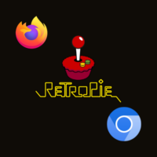

Hola de nuevo, en esta entrada vamos a instalar un navegador web para RetroPie. Esta entrada forma parte de un grupo para ver el resto de entradas relacionadas entra [aquí](https://piscinadeentropia.es/raspberry/raspberry_juguemos-con-retropie/).

Existen dos navegadores que se pueden instalar en RetroPie, uno es Firefox ESR y el otro es Chromium (Es en el que se basa Chrome).

Los pasos que seguiremos para instalar el navegador serán los siguientes:

1. Accede al menu y cierra el emulation station
2. Clonamos el repositorio de Retropie-Extra con el siguiente comando `git clone https://github.com/Exarkuniv/RetroPie-Extra.git`
3. Entramos al directorio de RetroPie-Extra con `cd RetroPie-Extra`
4. Ejecutamos install-extras.sh con `bash install-extras.sh`
5. Se nos abrirá una pantalla interactiva en la que seleccionaremos "1 Choose which modules to install"
6. Navegaremos hasta la sección Suplementary
7. Y seleccionaremos con la tecla espacio uno de los dos navegadores disponibles: 175 [Chromium](https://www.chromium.org/chromium-projects/) o 178 [Firefox-ESR](https://www.mozilla.org/es-ES/)
8. Pulsamos Ok cuando hallamos seleccionado el navegador y esperamos a que finalice la instalación
9. Salimos del menu de RetroPie-Extra
10. Salimos de la consola y volvemos a emulationstation con `exit`
11. Vamos a la pestaña RetroPie Setup del menu de RetroPie
12. Vamos a la sección Manage Packages
13. Seleccionamos "Manage all packages"
14. Navegamos hasta el final de la lista a la sección RetroPie-Extra
15. Seleccionamos Chromium o Firefox-ESR y pulsamos intro
16. Seleccionamos "install from pre-compiled file"
17. Esperamos a que se complete la instalación
18. Salimos del menu
19. Reiniciamos Emulationstation
20. Ahora en la sección PORTS de nuestra RetroPie tenderemos Chromium o Firefox para poder navegar por internet

Aunque no vayan a ser el navegador mas rápido del mundo por las limitaciones de la Pi, tampoco es como navegar con elinks.

Y esto es todo por esta entrada, os recuerdo que:

**Tengo pensado continuar con el tema de RetroPie, por ello he creado esta sub página donde puedes [ver las entradas del tema](https://piscinadeentropia.es/raspberry/raspberry_retropie_intro.md).**
