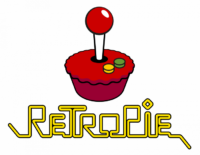
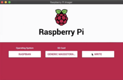
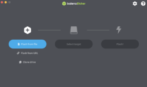
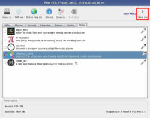

Hola de nuevo, en esta entrada vamos a instalar RetroPie y a aprender a usarlo para poder jugar a nuestros juegos retro favoritos y mucho mas...

RetroPie es un cruce entre emuladores para videojuegos (como ScummVM) y un sistema operativo (como Ubuntu), RetroPie se ejecuta a partir del Raspberry Pi OS que es una distribución de Debian (Linux) pero incluye con ella muchos emuladores y permite utilizar mandos bluetooth, ver películas con su nueva función Kodi y mucho mas...

## Instalación de RetroPie

Existen varias formas de proceder por ello te dejo a continuación las opciones, **es importante que en cualquiera de ellas te asegures de el disco que escribes por que puedes estar escribiendo el de tu propio ordenador**:

#### Instalar con Raspberry Pi Imager (Recomendado)

1. Instala Raspberry Pi Imager desde [aquí](https://www.raspberrypi.com/software/raspberry-pi-desktop/)
2. Conecta el disco que quieres usar al equipo
3. Abre Imager
4. En la pestaña OS selecciona Emulation and Game OS
5. Selecciona RetroPie
6. Selecciona la opción que mas se adapte a tu Raspberry Pi
7. Selecciona el disco donde vas a grabar la imagen (la SD o desde donde arranque tu Pi)
8. Pulsa Write
9. Espera a que se complete la escritura y desconecta el disco cuando Imager te lo indique

#### Instalar con otro Imager diferente

En nuestro caso vamos a usar [Etcher](https://www.balena.io/etcher) que es uno de los Imager mas famosos pero cada uno puede usar el de su preferencia ya que tienen un funcionamiento similar y por ello estos pasos se aplican a todos (También se puede usar como Imager Raspberry Pi Imager pero dandole nosotros la imagen que queremos que escriba, sin embargo tendremos un resultado similar a el de la anterior opción).

1. Descarga la Imagen de RetroPie desde [aquí](https://retropie.org.uk/download/) (Elige la que mejor se adapte a tu Pi)
2. Descomprime el archivo de forma que la terminación del archivo pase de ser .img.gz a solo ser .img (La mayoría de utilidades de descompresión lo harán)
3. Conecta el disco a tu equipo
4. Abre tu Imager
5. Pulsa Flash from File o el botón que te deje seleccionar la imagen que quieres escribir en el disco, y seleccionamos la imagen descomprimida (.img)
6. Seleccionamos nuestro disco
7. Y por ultimo pulsamos Flash o Write
8. Esperamos a que se complete el proceso y desconectamos el disco del equipo

#### Instalar con linea de comandos

**Esta opción solo la recomiendo para usuarios avanzados ya que si no se sabe usar bien el terminal se podrían llegar a escribir los discos internos del ordenados u otras memorias y por lo tanto borrar permanentemente sus datos, piscinadeentropia.es no se hace responsable en caso de daños**.

1. Descarga la Imagen de RetroPie desde [aquí](https://retropie.org.uk/download/) (Elige la que mejor se adapte a tu Pi)
2. Descomprime el archivo de forma que la terminación del archivo pase de ser .img.gz a solo ser .img (Puedes hacerlo con el comando `gzip -d filename`)
3. Conecta el disco a tu equipo
4. Asegurese de en que ruta monta su Sistema Operativo los discos
5. Ejecuta el commando: `sudo dd bs=4M if=/direccion/de/la/imagen of=/direccion/montaje/disco` Ejemplos de la ruta de  montaje de discos(**Estos son solo ejemplos de la ruta, no tienen por que ser donde su equipo monte los discos**): MacOS -> /dev/disk0, Linux -> /dev/sdb2
6. Esperamos a que la grabación concluya
7. Retiramos el disco de nuestro equipo

#### Instalar con PINN (similar a [NOOBS](https://github.com/raspberrypi/noobs))

Para quien no lo sepa, antes de que existiera Imager Raspberry Pi diseño un sistema llamado [NOOBS](https://github.com/raspberrypi/noobs) que te permitía instalar directamente el sistema operativo que quisieras en tu Raspberry Pi directamente desde ella tan solo con conexión a internet "sin necesidad de otro ordenador" para grabar la tarjeta. En la actualidad NOOBS ya no obtiene soporte y Raspberry Pi no recomienda su uso, sin embargo existe un Fork del mismo llamado [PINN](https://github.com/procount/pinn) y que todavía se puede utilizar.

Primera parte de la instalación, descargamos PINN:

1. [Descargamos PINN](https://sourceforge.net/projects/pinn/files/pinn-lite.zip/download) desde un ordenador externo
2. Conectamos el disco que vamos a querer usar con nuestra Pi para poder grabarle PINN
3. Descomprimimos PINN
4. Copiamos todos los archivos de PINN (Copiamos todos los archivos de la carpeta pero no la carpeta) y los pegamos en nuestro disco vacío
5. Expulsamos el Disco

Segunda Parte de la instalación, ejecutamos PINN e instalamos el Sistema Operativo que queramos:

1. Encendemos nuestra Pi
2. Esperamos a que se inicialize PINN
3. Conectamos PINN a una red mediante Ethernet o WIFI
4. Vamos a la pestaña Games
5. Seleccionamos la opción de RetroPie que mejor se adapte a nuestra Pi
6. Esperamos a que PINN instale el OS
7. Y listo, RetroPie se ejecuta automáticamente después de la descarga

#### Otras opciones

Para leer sobre otras opciones, puedes consultar la guía oficial de instalación que puedes encontrar [aquí](https://retropie.org.uk/docs/First-Installation/).

 

**Tengo pensado continuar con el tema de RetroPie, por ello he creado esta sub página donde puedes [ver las entradas del tema](https://piscinadeentropia.es/raspberry/raspberry_retropie_intro.md), mas adelante publicaré Setup RetroPie.**
